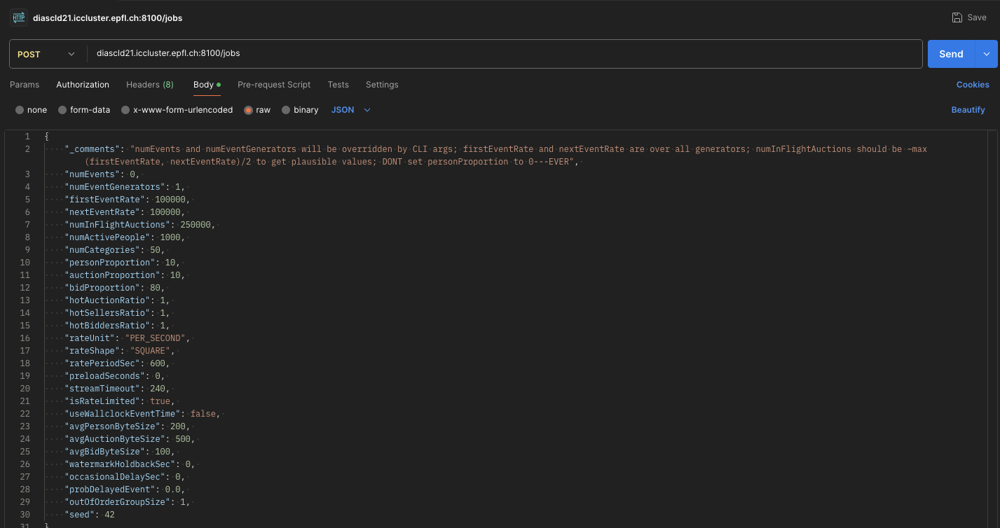
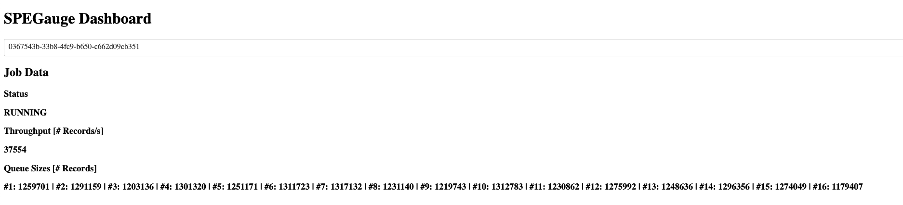

# SPEGauge: Stream Processing Engine Gauge

Standalone load generator for research on distributed stream processing systems.

## Project Overview

```
├── LICENSE
├── README.md                                       # this file
├── mvnw                                            # Maven wrapper (*nix systems)
├── mvnw.cmd                                        # Maven wrapper (Windows)
├── pom.xml                                         # Parent pom
├── requirements.txt                                # Dependencies for all Python applications in this repository
├── example-configurations                          # Configuration examples for supported datasets (JSON files)
├── spegauge-api                                    # Common API that defines interfaces for data generators and events (Java). Used in spegauge-driver and spegauge-generators and all SDKs. 
├── spegauge-dashboard                              # Web dashboard to visualize metrics of the driver (Python) 
├── spegauge-driver                                 # Driver application (Java)
├── spegauge-flink-queries                          # Queries for benchmarking apache Flink (Java)
├── spegauge-flink-sdk                              # SDK for Apache Flink (Java)
├── spegauge-generators                             # A set of provided data generators (Java) and a validator for the configuration files (Python)
```

### `spegauge-api`

#### `common.model`

Data models (used in data generator and in the system under test SDKs)

#### `driver`

Interfaces implemented by event generators and used in the driver.

- `Event`: basic unit during event generation
- `EventGenerator`: Iterable container of events
- `EventGeneratorFactory`: returns a bound or unbound number of `EventGenerator` instances (but at least one for each generator instance in the driver)

#### `sut`

TODO

### `spegauge-dashboard`

Very rudimentary dashboard to visualize metrics of the driver (total throughput and # of queue events per queue).

### `spegauge-driver`

Driver application. See `java -jar spegauge-driver/target/spegauge-driver-0.1.0-SNAPSHOT.jar --help` for further information.

### `spegauge-flink-queries`

Queries for benchmarking Apache Flink (e.g., NEXMark).

### `spegauge-flink-sdk`

SDK for Apache Flink. To use a source or sink with a new dataset, extend the abstract classes and implement the corresponding hooks (abstract methods).

### `spegauge-generators`

Provided data generators that implement the interfaces in `spegauge-api`. The path to the JAR is passed as argument to the driver application (see below)


## Setup

Prerequisites
- Java 11
- Python 3.8
- Apache Flink binaries (tested with 1.13.6)

If not stated otherwise, all commands are executed in the root directory of the repository.


### Compile and Package the Project

**WHERE?** packaging locally on your machine and cluster; copy command on cluster
  
- Package all JARs

  ```bash
  ./mvnw clean package
  ```

- Copy `spegauge-api/target/spegauge-api-0.1.0-SNAPSHOT.jar` and `spegauge-flink-sdk/target/spegauge-flink-sdk-0.1.0-SNAPSHOT.jar` to the `lib/` directory of your Apache Flink application.
- Restart the Apache Flink cluster, if it is running


### Driver Dashboard

**WHERE?** locally on your machine

For the dashboard, there is a single `requirements.txt` file in the root directory of the repository.

- Create a virtual environment and activate it

  ```bash
  python3 -m venv venv && source venv/bin/activate
  ```

- Install dependencies

  ```bash
  pip3 install -r requirements.txt
  ```


## Examples

### NEXMark

#### Manual Job Submission

**WHERE?** cluster

- Run the driver application (16 parallel generators, 25M events per generator). The last line on the console should be `[main] INFO io.javalin.Javalin - Javalin started in ...ms \o/`.

  ```bash
  java -jar spegauge-driver/target/spegauge-driver-0.1.0-SNAPSHOT.jar -g 16 spegauge-generators/target/spegauge-generators-0.1.0-SNAPSHOT.jar
  ```

- Submit a POST request to the driver's web API (`/jobs`), e.g., using Postman (see screenshot below). The request contains the details for data generation (see `data-config/nexmark-example-config.json` for an example).

  

- Submit a job to the flink cluster (in this example, NEXMark query 4 is used)

  ```bash
  flink run -p 8 spegauge-flink-queries/target/spegauge-flink-queries-0.1.0-SNAPSHOT.jar -m nexmark --driver diascld21.iccluster.epfl.ch:8110 -- Query4
  ```

#### Automatically Find Sustainable Throughput

**ATTENTION**: Make sure the virtual environment is activated.

##### Driver Application

**WHERE?** cluster

- Run the driver application (16 parallel generators, 25M events per generator). The last line on the console should be `[main] INFO io.javalin.Javalin - Javalin started in ...ms \o/`.

  ```bash
  java -jar spegauge-driver/target/spegauge-driver-0.1.0-SNAPSHOT.jar -g 16 spegauge-generators/target/spegauge-generators-0.1.0-SNAPSHOT.jar
  ```

##### Runner

**WHERE?** locally on your machine

- Run `runner.py` (host is the Apache Flink cluster; parallelism 2, Query 4; `firstEventRate` in the config is the highest event rate that should be tested; positional arguments are the arguments for the job submission to the Apache Flink cluster)

  ```bash
  python3 spegauge-runner/runner.py -p 8 --dataset nexmark --host http://diascld21.iccluster.epfl.ch:<port of Flink web API> --driver http://diascld21.iccluster.epfl.ch:<port of driver web API> --jar ./spegauge-flink-queries/target/spegauge-flink-queries-0.1.0-SNAPSHOT.jar --datagen-config <path to configuration. for an example see example-configurations> -- "-m nexmark --driver diascld21.iccluster.epfl.ch:8110 -- Query4"
  ```

The scripts automatically finds the sustainable throughput using binary search and logs the results to a CSV file. The results can also be logged to Weights & Biases (see `python3 runner.py -h` for further information).

 

## Dashboard

**WHERE?** locally on your machine

- Make sure the virtual environment is activated

  ```bash
  source venv/bin/activate
  ```
  
- Start the dashboard

  ```bash
  python3 spegauge-dashboard/app.py -- "http://<host>:<port of driver *web* API>"
  ```
  
- Open the dashboard in your browser (http://localhost:8050). You can select a job ID from the dropdown menu. Job IDs are ephemeral and are not persisted between restarts of the driver application.


